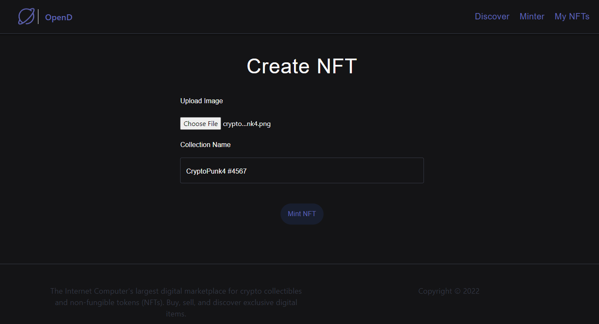
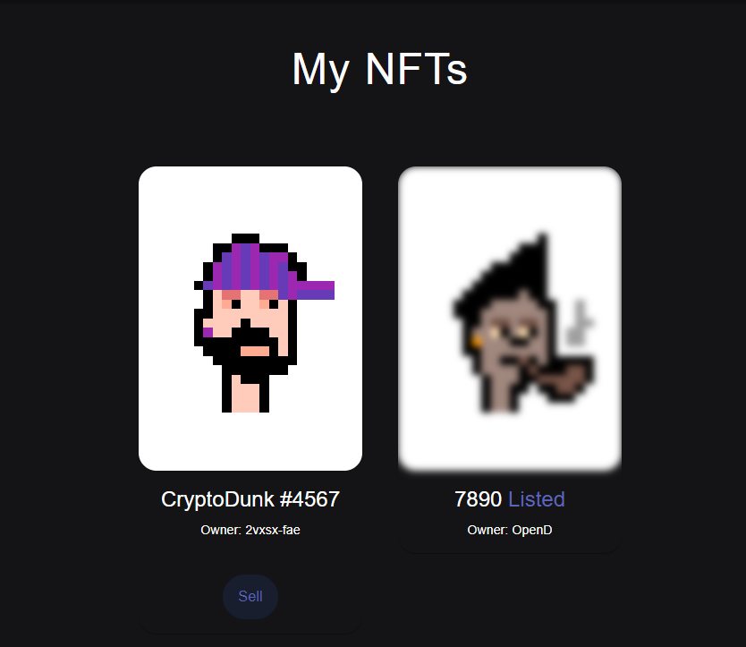
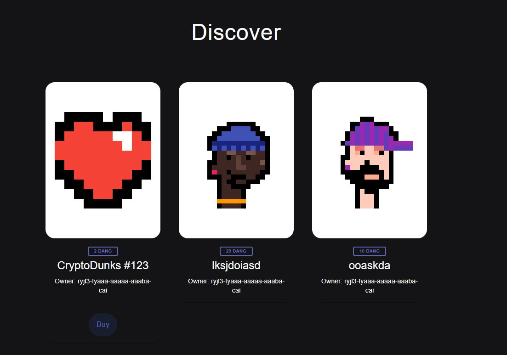

# OpenD -> NFT marketplace

- OpenD NFT Marketplace is a place where we can **mint, list, sell** and **buy NFT** on Internet Computer (ICP) Blockchain.
- In this marketplace, all the NFT minted will be created on the ICP blockchain which means all actual NFT data will be stored on the chain

Functionality
- **Mint NFTs** → Adding or creating NFT. Once minted you can see NFTs in your collection.
    - This will create an unique canister on the ICP blockchain that contains all of the data for your image file that you have minted.

    

- **View NFTs** → We can view NFTs that the logged in user owns

    

- **Sell NFTs** → The user can sell these NFTs by clicking on Sell and then setting a price in DKEE, The keery token/coin which anyone can claim from previous project that we have created
- **Buy NFTs** → Once these items are sold, then you will be able to see them on the Discover page where they are listed for people to buy
    - You can pay using DKEE coin and once purchases, NFT will be shown in your collection

    


## To Install and Run the Project

1. start local dfx

```
dfx start --clean
```

2. Run NPM server

```
npm start
```

3. Deploy canisters

```
dfx deploy --argument='("CryptoDunks #123", principal "f4ms3-vhmcb-hhldt-hv5zr-s7ml4-ot5jc-edrpe-5nxjb-a7gio-d2f6a-jqe", (vec {137; 80; 78; 71; 13; 10; 26; 10; 0; 0; 0; 13; 73; 72; 68; 82; 0; 0; 0; 10; 0; 0; 0; 10; 8; 6; 0; 0; 0; 141; 50; 207; 189; 0; 0; 0; 1; 115; 82; 71; 66; 0; 174; 206; 28; 233; 0; 0; 0; 68; 101; 88; 73; 102; 77; 77; 0; 42; 0; 0; 0; 8; 0; 1; 135; 105; 0; 4; 0; 0; 0; 1; 0; 0; 0; 26; 0; 0; 0; 0; 0; 3; 160; 1; 0; 3; 0; 0; 0; 1; 0; 1; 0; 0; 160; 2; 0; 4; 0; 0; 0; 1; 0; 0; 0; 10; 160; 3; 0; 4; 0; 0; 0; 1; 0; 0; 0; 10; 0; 0; 0; 0; 59; 120; 184; 245; 0; 0; 0; 113; 73; 68; 65; 84; 24; 25; 133; 143; 203; 13; 128; 48; 12; 67; 147; 94; 97; 30; 24; 0; 198; 134; 1; 96; 30; 56; 151; 56; 212; 85; 68; 17; 88; 106; 243; 241; 235; 39; 42; 183; 114; 137; 12; 106; 73; 236; 105; 98; 227; 152; 6; 193; 42; 114; 40; 214; 126; 50; 52; 8; 74; 183; 108; 158; 159; 243; 40; 253; 186; 75; 122; 131; 64; 0; 160; 192; 168; 109; 241; 47; 244; 154; 152; 112; 237; 159; 252; 105; 64; 95; 48; 61; 12; 3; 61; 167; 244; 38; 33; 43; 148; 96; 3; 71; 8; 102; 4; 43; 140; 164; 168; 250; 23; 219; 242; 38; 84; 91; 18; 112; 63; 0; 0; 0; 0; 73; 69; 78; 68; 174; 66; 96; 130;}))'
```

4. Head to localhost

http://localhost:8080/


## Creating NFT for Testing

1. Mint an NFT on the command line to get NFT into mapOfNFTs:

```
dfx canister call opend mint '(vec {137; 80; 78; 71; 13; 10; 26; 10; 0; 0; 0; 13; 73; 72; 68; 82; 0; 0; 0; 10; 0; 0; 0; 10; 8; 6; 0; 0; 0; 141; 50; 207; 189; 0; 0; 0; 1; 115; 82; 71; 66; 0; 174; 206; 28; 233; 0; 0; 0; 68; 101; 88; 73; 102; 77; 77; 0; 42; 0; 0; 0; 8; 0; 1; 135; 105; 0; 4; 0; 0; 0; 1; 0; 0; 0; 26; 0; 0; 0; 0; 0; 3; 160; 1; 0; 3; 0; 0; 0; 1; 0; 1; 0; 0; 160; 2; 0; 4; 0; 0; 0; 1; 0; 0; 0; 10; 160; 3; 0; 4; 0; 0; 0; 1; 0; 0; 0; 10; 0; 0; 0; 0; 59; 120; 184; 245; 0; 0; 0; 113; 73; 68; 65; 84; 24; 25; 133; 143; 203; 13; 128; 48; 12; 67; 147; 94; 97; 30; 24; 0; 198; 134; 1; 96; 30; 56; 151; 56; 212; 85; 68; 17; 88; 106; 243; 241; 235; 39; 42; 183; 114; 137; 12; 106; 73; 236; 105; 98; 227; 152; 6; 193; 42; 114; 40; 214; 126; 50; 52; 8; 74; 183; 108; 158; 159; 243; 40; 253; 186; 75; 122; 131; 64; 0; 160; 192; 168; 109; 241; 47; 244; 154; 152; 112; 237; 159; 252; 105; 64; 95; 48; 61; 12; 3; 61; 167; 244; 38; 33; 43; 148; 96; 3; 71; 8; 102; 4; 43; 140; 164; 168; 250; 23; 219; 242; 38; 84; 91; 18; 112; 63; 0; 0; 0; 0; 73; 69; 78; 68; 174; 66; 96; 130;}, "CryptoDunks #123")'
```

2. List the item into mapOfListings:

```
dfx canister call opend listItem '(principal "<REPLACE WITH NFT CANISTER ID>", 2)'
```

3. Get OpenD canister ID:

```
dfx canister id opend
```

4. Transfer NFT to OpenD:

```
dfx canister call <REPLACE WITH NFT CANISTER ID> transferOwnership '(principal "<REPLACE WITH OPEND CANISTER ID>", true)'


```

## Conneting to the Token Canister

1. Copy over the token declarations folder

2. Set the token canister id into the <REPLACE WITH TOKEN CANISTER ID>

```
const dangPrincipal = Principal.fromText("<REPLACE WITH TOKEN CANISTER ID>");
```
